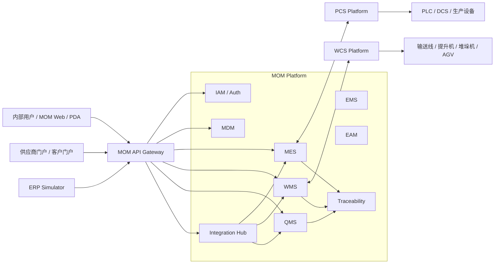

<div align="center">

# MOM Platform

### 面向新能源材料制造的开源工业 MOM 平台

从供应商送货、质量检验、生产执行、设备协同，到自动仓储、客户发运与批次追溯，构建一套可部署、可演示、可持续演进的工业软件底座。

<p>
  <a href="https://github.com/Chris-co-shi/mom-platform/actions/workflows/ci.yml">
    
  </a>
  
  
  
  
  
</p>

[文档中心](docs/README.md) · [V1 需求](docs/requirements/V1需求清单.md) · [实施路线图](docs/plans/V1路线图.md) · [总体架构](docs/architecture/系统上下文.md) · [ADR](docs/adr/README.md)

</div>

---

> [!IMPORTANT]
> 当前项目处于 **V1 技术骨架与架构准备阶段**。仓库已经建立 Maven 多模块骨架、领域边界和文档约束，但尚未形成可直接用于生产的完整业务系统。

## 🌟 项目愿景

`MOM Platform` 面向新能源材料制造场景，以锂电池电解液为主演示产品，目标不是再做一套通用 CRUD 后台，而是验证工业软件中最关键、最难复用的能力：

- 跨 MES、WMS、QMS 的业务边界与一致性。
- 原料、半成品、成品之间的多对多批次谱系。
- 库存事实流水、实时余额、预占与锁定。
- PCS/WCS 异步命令、状态机、故障恢复和人工接管。
- 外部系统接入、幂等、补偿、对账和链路追踪。
- 三节点 k3s 下的部署、扩缩容、滚动升级和故障演练。

### V1 端到端业务闭环

```text
供应商送货
    ↓
原料检验 ──→ 不合格处置
    ↓
原料入库
    ↓
生产计划与工单
    ↓
PCS 投料 / 混合 / 灌装
    ↓
成品检验与放行
    ↓
WCS 自动入库
    ↓
客户发运
    ↓
客诉 / 正反向追溯 / 模拟召回
```

## 🧭 系统全景



## 🧩 核心能力

| 能力域 | V1 关注点 | 权威模块 |
|---|---|---|
| 身份与权限 | OAuth2.1、OIDC、角色、权限、数据范围 | `mom-iam-platform` |
| 主数据 | 集团、工厂、物料、供应商、客户、版本索引 | `mom-mdm-platform` |
| 生产执行 | 工单、版本快照、投料、过程记录、报工 | `mom-mes-platform` |
| 仓储库存 | 库位、容器、批次、预占、流水、余额、对账 | `mom-wms-platform` |
| 质量管理 | 检验、放行、不合格处置、偏差、CAPA | `mom-qms-platform` |
| 系统集成 | 外部接口、Outbox/Inbox、重试、补偿、对账 | `mom-integration-platform` |
| 批次追溯 | 正向追溯、反向追溯、影响分析、模拟召回 | `mom-traceability-platform` |
| 能源与资产 | 能耗采集、设备台账、点检、保养、维修 | `mom-ems-platform` / `mom-eam-platform` |
| 平台治理 | Gateway、Redis 限流、审计、链路追踪 | `mom-gateway` / `mom-framework` |

## 🛠️ 技术基线

| 层次 | 技术选型 |
|---|---|
| Java 运行时 | JDK 25 |
| 应用框架 | Spring Boot 4.1.x、Spring Framework 7.x |
| 微服务体系 | Spring Cloud 2025.1.x、Spring Cloud Alibaba 2025.1.x |
| 身份认证 | Spring Authorization Server、OAuth2.1、OIDC |
| 数据存储 | PostgreSQL，按服务独立 Schema |
| 缓存与限流 | Redis、分布式令牌桶 |
| 消息与一致性 | RocketMQ、Outbox/Inbox、幂等、Seata |
| 注册与配置 | Nacos |
| 可观测性 | Micrometer、OpenTelemetry、Tempo、Prometheus、Loki、Grafana |
| 部署环境 | 三节点 k3s |
| 测试体系 | JUnit 5、Testcontainers、ArchUnit |

> 具体版本以根目录 `pom.xml` 和 `mom-dependencies` 为唯一权威来源。

## 🏗️ 仓库结构

```text
mom-platform
├── mom-dependencies               # 统一依赖版本清单
├── mom-framework                  # 平台通用能力
│   ├── mom-core
│   ├── mom-security
│   ├── mom-data
│   ├── mom-data-permission
│   ├── mom-openfeign
│   ├── mom-messaging
│   ├── mom-idempotency
│   ├── mom-outbox
│   ├── mom-observation
│   ├── mom-tracing
│   ├── mom-logging
│   ├── mom-metrics
│   ├── mom-rate-limit
│   └── mom-test
├── mom-gateway
├── mom-iam-platform
├── mom-mdm-platform
├── mom-mes-platform
├── mom-wms-platform
├── mom-qms-platform
├── mom-ems-platform
├── mom-eam-platform
├── mom-integration-platform
├── mom-traceability-platform
└── mom-bootstrap-tests
```

每个核心领域平台统一按以下方式分层：

```text
mom-xxx-platform
├── mom-xxx-api       # DTO、命令、查询、事件契约、枚举
├── mom-xxx-client    # Feign 客户端与调用适配
└── mom-xxx-server    # 接口层、应用层、领域层、基础设施层
```

### 强制依赖规则

```text
mom-core
   ↑
framework capabilities
   ↑
domain api / client / server
   ↑
gateway and bootstrap tests
```

- `*-api` 不暴露数据库 Entity、Mapper 或 Repository。
- `*-server` 禁止依赖其他领域的 `*-server`。
- 跨领域同步调用通过 `*-client`，异步协作通过领域事件。
- PostgreSQL 每服务独立 Schema，禁止跨 Schema JOIN 和跨域写入。
- `mom-framework` 不得包含 MES、WMS、QMS 等业务规则。
- PCS 与 WCS 保持独立仓库和独立部署边界。

## 🚀 快速开始

### 环境要求

- JDK 25
- Maven 3.9.9+
- Git

### 验证 Maven Reactor

```bash
mvn -B -ntp clean verify
```

当前阶段该命令主要验证：

- JDK 与 Maven 版本门禁。
- Maven 多模块依赖关系。
- 基础测试和模块骨架。
- 后续逐步加入的 ArchUnit 与兼容性测试。

> 中间件一键启动和业务服务运行方式将在 `mom-infra` 与 Phase 01 技术骨架完成后补充。

## 📚 文档导航

| 分类 | 入口 | 说明 |
|---|---|---|
| 文档总览 | [文档中心](docs/README.md) | 全部文档导航与维护规则 |
| 需求 | [产品范围](docs/requirements/产品范围.md) | 项目定位、系统边界和 V1 目标 |
| 需求 | [V1 需求清单](docs/requirements/V1需求清单.md) | 编号化功能需求与验收边界 |
| 需求 | [非功能需求](docs/requirements/非功能需求.md) | 性能、安全、幂等、可观测性等要求 |
| 计划 | [V1 路线图](docs/plans/V1路线图.md) | 一个月实施阶段和交付目标 |
| 计划 | [Phase 01 技术骨架](docs/plans/Phase-01-技术骨架计划.md) | 当前阶段的 Slice、验收与完成定义 |
| 计划 | [V1 垂直切片](docs/plans/V1垂直切片计划.md) | VS-00 至 VS-01H 的业务拆分 |
| 架构 | [系统上下文](docs/architecture/系统上下文.md) | MOM 与用户、ERP、PCS、WCS 的关系 |
| 架构 | [领域边界](docs/architecture/领域边界.md) | 权威数据归属和服务职责 |
| 架构 | [数据架构](docs/architecture/数据架构.md) | 库存、谱系、Outbox/Inbox 与 Schema 隔离 |
| 架构 | [可观测性架构](docs/architecture/可观测性架构.md) | Trace、Metric、Log 和业务关联标识 |
| 决策 | [ADR 索引](docs/adr/README.md) | 所有关键架构决策及状态 |

## 🗺️ 当前路线图

| 阶段 | 目标 | 状态 |
|---|---|---|
| Phase 01 | JDK 25 + Boot 4 技术骨架、Gateway、IAM、MDM、Integration | 🚧 进行中 |
| Phase 02 | 供应商送货、来料检验、PDA 入库、库存闭环 | ⏳ 计划中 |
| Phase 03 | 生产工单、PCS 协同、半成品与成品批次 | ⏳ 计划中 |
| Phase 04 | 成品放行、WCS 入库、客户发运、追溯和召回 | ⏳ 计划中 |

### Phase 01 当前优先事项

- [ ] 完成 JDK 25 + Spring Boot 4 中间件兼容性矩阵。
- [ ] 建立 Gateway、IAM、MDM、Integration 最小启动闭环。
- [ ] 验证 PostgreSQL、Redis、Nacos、RocketMQ 和 Seata。
- [ ] 接通 OpenTelemetry、OTLP Collector 和 Tempo。
- [ ] 完成 Gateway Redis 多实例限流。
- [ ] 建立 Outbox/Inbox 与消息幂等基础能力。

在 Phase 01 验收通过前，不进入大规模业务 CRUD 开发。

## 🔗 MOM 项目仓库族

| 仓库 | 职责 |
|---|---|
| `mom-platform` | MOM 后端平台与通用 Framework |
| `pcs-platform` | 生产设备协同、协议适配和状态机 |
| `wcs-platform` | 自动仓储调度、运输任务和设备恢复 |
| `mom-web` | 管理端、供应商门户、客户门户及 Web 原型 |
| `mom-mobile` | uni-app PDA、扫码和离线队列 |
| `erp-simulator` | ERP/SAP 接口与异常场景模拟 |
| `mom-infra` | k3s、中间件、可观测性和部署脚本 |

## 🧠 架构原则

1. **领域优先**：业务边界不能由数据库表或通用 CRUD 框架反向定义。
2. **事实优先**：库存、批次和质量结果以不可重复的业务事实为基础。
3. **异步可恢复**：长流程默认使用消息、幂等、重试、补偿和对账。
4. **集成有边界**：外部系统统一通过 Gateway 与 Integration Hub 接入。
5. **可观测优先**：HTTP、Feign、MQ、任务和设备命令必须可以关联追踪。
6. **原型先行**：Web 与 PDA 开发前必须完成流程、状态和原型设计。
7. **开源合规**：标准依赖直接使用，机制学习后重构，领域内核自主实现。

## 🤝 开源复用与贡献

- Spring 生态、协议 SDK 和基础设施通过正式依赖复用。
- Pig、Yudao Cloud、JetLinks、OpenWMS 等项目仅作为机制和领域研究来源。
- MOM 核心领域、库存一致性、批次谱系、Integration Hub、PCS/WCS 状态机必须自主设计。
- 新增第三方依赖或参考源码时，必须同步更新 [开源来源登记](docs/open-source/source-origin.md) 和 `THIRD-PARTY-NOTICES.md`。

贡献指南、Issue 模板、PR 模板和版本发布约定将在技术骨架稳定后补充。

---

<div align="center">

**MOM Platform — 让工业业务边界、系统集成与故障恢复成为可复用的工程能力。**

</div>
