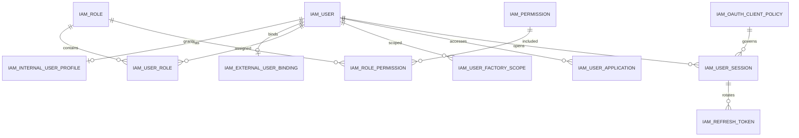

# IAM 数据库与领域模型

- 阶段：`P1.5 S02`
- 状态：**Implemented in branch / PR Ready**
- Schema：`mom_iam`
- 权威设计：[P1.5 认证与授权设计基线](../security/P1.5-认证与授权设计基线.md)
- CurrentActor 与审计：[CurrentActor 与数据审计基础](CurrentActor与数据审计.md)

## 1. 交付边界

S02 建立 IAM PostgreSQL Schema、Flyway、持久化 Entity、Mapper、受控 Repository、跨表领域校验和初始化目录。它为 S03、S04、S05、S07 提供稳定数据基础，但不实现登录、Authorization Server 端点、JWT 签发、权限计算、Refresh Rotation、Session 撤销或管理 API。

```text
S02 Schema & Domain
├── S03 Authorization Server / Account Authentication
├── S04 RBAC / Factory Scope / Party Scope / me
├── S05 Session / Refresh Rotation / Revocation
└── S07 IAM Management API
```

## 2. PostgreSQL 治理

IAM 复用平台 PostgreSQL Database `mom_platform`，只操作独立 Schema `mom_iam`：

- DataSource：唯一 HikariCP 连接池；
- ApplicationName：`mom-iam-server`；
- Pool Name：`mom-iam-hikari`；
- Session Time Zone：UTC；
- Flyway Location：`classpath:db/migration/iam`；
- Flyway Clean：disabled；
- Java ID：`String`；
- MOM 表 ID：`varchar(19)`；
- Java 时间：`Instant`；
- PostgreSQL 时间：`timestamptz`。

Flyway 文件：

1. `V1__create_iam_identity_tables.sql`：用户、内部资料、外部 Party Binding；
2. `V2__create_iam_rbac_scope_tables.sql`：RBAC、Factory Scope、Mobile Access、Client Policy；
3. `V3__create_iam_oauth_session_tables.sql`：Spring Security 官方协议表、Session、Refresh Token；
4. `V4__create_iam_security_audit_tables.sql`：追加型安全审计；
5. `V5__seed_iam_roles_permissions.sql`：内置角色和 28 个 Permission；
6. `V6__seed_iam_role_permissions.sql`：59 条内置角色权限映射；
7. `V7__seed_iam_client_policies.sql`：四个稳定 Client Policy。

IAM 不创建第二 DataSource，不引入动态数据源，不跨 Schema 查询 MDM 表，也不建立到 MDM Factory、Supplier 或 Customer 的数据库外键。

## 3. 表清单

| 分类 | 表 |
|---|---|
| 账号与主体 | `iam_user`、`iam_internal_user_profile`、`iam_external_user_binding` |
| RBAC | `iam_role`、`iam_permission`、`iam_user_role`、`iam_role_permission` |
| Scope 与应用 | `iam_user_factory_scope`、`iam_user_application`、`iam_oauth_client_policy` |
| 官方 OAuth 协议 | `oauth2_registered_client`、`oauth2_authorization`、`oauth2_authorization_consent` |
| Session 与 Refresh | `iam_user_session`、`iam_refresh_token` |
| 安全审计 | `iam_security_audit_event` |



## 4. 用户与 Party

`iam_user` 统一保存 `INTERNAL`、`SUPPLIER`、`CUSTOMER` 登录账号。临时锁定使用 `locked_until`，不增加 `LOCKED` 状态。

- INTERNAL 用户可拥有一条 `iam_internal_user_profile`；
- SUPPLIER/CUSTOMER 用户可拥有一条 `iam_external_user_binding`；
- Party Binding 只保存 `party_type + party_id`；
- `party_id` 是跨服务引用，不复制主体主数据；
- UserType 与 PartyType 一致性由 `IamDomainRules` 校验；
- 不创建默认管理员用户、默认密码或公共弱口令。

## 5. RBAC

模型固定为：

```text
User → UserRole → Role → RolePermission → Permission
```

约束：

- 用户不直接分配 Permission；
- Role 限定 `applicable_user_type`；
- Role 不绑定 Factory；
- 不支持 Role 继承、Deny 或 ABAC；
- Permission Code 使用 `domain:resource:action`；
- Permission 由代码和 Flyway 管理，不作为 OAuth Scope 动态注册。

初始化角色：

- `PLATFORM_ADMIN`
- `IAM_ADMIN`
- `SECURITY_AUDITOR`

初始化 28 个 IAM Permission。`PLATFORM_ADMIN` 拥有全部初始化 Permission；`SECURITY_AUDITOR` 仅拥有读取用户、角色、Permission、Session、安全审计和 Client 的权限。

## 6. Factory Scope 与 Mobile Access

`iam_user_factory_scope` 只保存 `factory_id` 引用，不实现 `ALL_FACTORIES`、组织树继承或按 Factory 分配 Role。

`iam_user_application` 保存需要用户级单独授权的应用访问，P1.5 主要用于 `MOM_MOBILE_PDA`。Mobile Access 只允许 INTERNAL 用户，领域层通过 `IamDomainRules.requireApplicationAccess` 校验。

外部用户的 Factory Scope 是否属于其 Party 有效业务关系子集，需要 S07 管理 API 调用 MDM 验证，数据库不复制该业务关系。

## 7. Client Policy 与 Registered Client

`iam_oauth_client_policy` 只保存 MOM 应用访问矩阵：

| Client ID | Application | Channel | UserType | Mobile Access |
|---|---|---|---|---|
| `mom-admin-web` | `MOM_ADMIN` | WEB | INTERNAL | false |
| `mom-supplier-web` | `MOM_SUPPLIER_PORTAL` | WEB | SUPPLIER | false |
| `mom-customer-web` | `MOM_CUSTOMER_PORTAL` | WEB | CUSTOMER | false |
| `mom-mobile-pda` | `MOM_MOBILE_PDA` | MOBILE | INTERNAL | true |

它不保存 Redirect URI、Grant Type、Scope、ClientSettings 或 TokenSettings。这些协议配置属于 `oauth2_registered_client`，并由 S03 按环境初始化。

S02 不向 `oauth2_registered_client` 写入四个 Client，避免把环境相关 Redirect URI 固化进通用 Flyway。

## 8. Spring Security Authorization Server Schema 来源

仓库技术基线为 Spring Boot 4.1 / Spring Security 7.1.0。官方 Authorization Server JDBC Schema 已迁入 `spring-projects/spring-security`：

- `oauth2-registered-client-schema.sql`，官方 Blob SHA：`ff7f1d682e1982a0ee469c971cf2d5ceecd92124`
- `oauth2-authorization-schema.sql`，官方 Blob SHA：`f93972822e1effaf2f5f50aec7e67b71386feb9a`
- `oauth2-authorization-consent-schema.sql`，官方 Blob SHA：`3020828abd3c4db7aa2ef36079f70a90006643ac`

路径位于：

```text
oauth2/oauth2-authorization-server/src/main/resources/
org/springframework/security/oauth2/server/authorization/
```

PostgreSQL 适配严格遵守官方文件头说明：

- 所有 `timestamp` 改为 `timestamptz`；
- 所有 `blob` 改为 `text`；
- 列名、长度和 JDBC Repository 所需结构保持一致；
- 不增加 MOM `deleted`、`version` 或通用审计字段；
- 增加中文 `COMMENT` 不改变协议兼容性。

集成测试使用 `JdbcRegisteredClientRepository` 与 `JdbcOAuth2AuthorizationService` 执行最小空表查询，验证 Schema 兼容。

## 9. Session 与 Refresh

`iam_user_session.id` 未来直接作为 JWT `sid`。Session 不保存 Access Token，也不复制角色、Permission、Factory IDs 或 Party 详情。

`iam_refresh_token` 只保存：

- HMAC-SHA-256 `token_digest`；
- 轮换序号；
- 状态时间；
- 后继 Token ID。

Server Pepper 不在数据库。部分唯一索引：

```sql
UNIQUE (session_id) WHERE status = 'ACTIVE'
```

保证每个 Session 最多一个 ACTIVE Refresh Token。S02 不实现 Token 生成、HMAC、行锁、Rotation、重放检测或撤销；这些属于 S05。

## 10. 安全审计

`iam_security_audit_event` 是追加型表：

- 无普通 UPDATE Repository；
- 无逻辑删除；
- 无版本字段；
- `occurred_at` 表示事件发生时间；
- `created_at` 表示持久化时间；
- `change_summary` 为受控 JSONB 对象；
- 默认 180 天保留策略只记录规则，S02 不实现清理任务。

`reason_detail` 和 `change_summary` 禁止密码、密码摘要、Access Token、Refresh Token、Token 摘要、Authorization Code、code_verifier、Authorization Header 或私钥。

## 11. BaseEntity 使用边界

- `BaseEntity`：`iam_user`、`iam_role`、`iam_permission`；
- `BaseAuditEntity`：内部资料、外部绑定、用户角色、应用访问、Factory Scope、Client Policy、Session；
- `BaseCreatedEntity`：Role-Permission 纯关系；
- `BaseIdEntity + 显式时间`：Refresh Token、安全审计；
- 官方 OAuth 协议表：不使用 MOM BaseEntity。

普通可更新 IAM Entity 复用 S01 `MomMetaObjectHandler`、CurrentActor、UTC Clock、乐观锁和 `MomBaseMapper`。Wrapper-only Update 继续被拒绝。

## 12. 数据库注释与外键

每张正式表和每个字段均提供完整中文 `COMMENT`。PostgreSQL Catalog 集成测试自动验证：

```text
数据库表注释缺失：0
数据库字段注释缺失：0
```

IAM 内部外键使用 `ON DELETE RESTRICT`，避免用户、角色、Permission、Session 历史引用被物理级联删除。Factory 与 Party 只保存跨服务 ID，不建立跨 Schema 外键。

## 13. 后续 Slice 使用方式

- S03：写入环境相关 Registered Client，接入账号认证和 Authorization Server；
- S04：读取 Role、Permission、Factory Scope、Party Binding，形成 `/api/iam/me` 和 JWT Claims；
- S05：基于 Session 与 Refresh Token 表实现绝对有效期、Rotation、重放检测和撤销；
- S07：提供用户、角色、Scope、Mobile Access、Session、安全审计和 Client 管理 API。

S02 不实现上述运行时行为。
