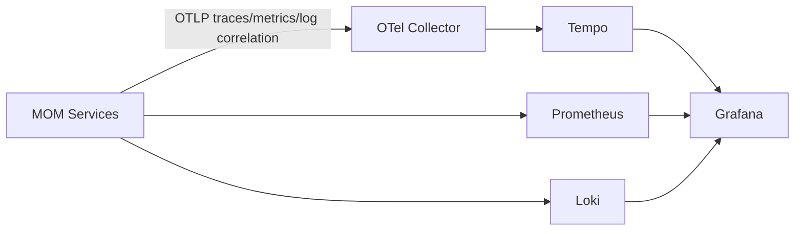

# 可观测性架构

## 1. 技术栈

```text
Spring Boot Actuator
Micrometer Observation
Micrometer Tracing
OpenTelemetry
OTLP
OpenTelemetry Collector
Tempo
Loki
Prometheus
Grafana
```

业务代码优先使用 Micrometer Observation API，避免直接绑定具体 Trace 后端。

## 2. 数据流



## 3. Trace 覆盖范围

必须覆盖：

- Browser/PDA 到 Gateway。
- Gateway 到领域服务。
- OpenFeign 同步调用。
- RocketMQ 生产、消费和重试。
- Outbox 发布任务。
- 定时任务和补偿任务。
- Integration Hub 入站和出站调用。
- MES 到 PCS 的命令与结果。
- WMS 到 WCS 的任务与回执。

## 4. 标识体系

| 标识 | 用途 | 生命周期 |
|---|---|---|
| `trace_id` | 一次技术调用链 | 秒到分钟 |
| `span_id` | Trace 内单个操作 | 毫秒到秒 |
| `correlation_id` | 跨 Trace 关联同一业务 | 小时到天 |
| `workflow_id` | 长流程实例 | 小时到天 |
| `event_id` | 领域事件幂等与追踪 | 长期 |
| `command_id` | PCS/WCS 命令幂等与追踪 | 分钟到小时 |
| 业务单号 | 送货、检验、工单、发运等 | 长期 |

长时间制造流程不维持一个超长 Trace；每个阶段创建新的 Trace，并通过 Span Link 和业务关联标识连接。

## 5. 日志规范

结构化日志至少包含：

- timestamp。
- level。
- service。
- environment。
- trace_id。
- span_id。
- correlation_id（存在时）。
- event_id 或 command_id（存在时）。
- error_code。
- message。

禁止记录：

- Access Token、Refresh Token、Cookie。
- 密码、Client Secret、数据库凭证。
- 大型完整消息 Payload。
- 无脱敏个人和敏感业务信息。

## 6. 指标规范

### 技术指标

- HTTP 请求量、耗时和错误率。
- JVM、GC、线程和连接池。
- Redis、数据库和 MQ 客户端指标。
- Gateway 限流允许、拒绝和降级次数。
- Outbox 待发布数量和最大延迟。
- MQ 重试、死信和消费延迟。

### 业务指标

- 收货成功/失败数量。
- 检验待处理和放行数量。
- 库存差异数量。
- 工单执行和异常数量。
- PCS/WCS 命令成功、失败和超时数量。
- 模拟召回影响批次数量。

Prometheus Label 只能使用低基数字段，例如服务、路由、事件类型和结果；禁止使用用户 ID、业务单号和 Trace ID。

## 7. Grafana 最小仪表盘

- 平台总览。
- Gateway 请求与 Redis 限流。
- JVM 与资源使用。
- PostgreSQL/Redis/RocketMQ 状态。
- Outbox/Inbox 与消息重试。
- MES/PCS 命令链路。
- WMS/WCS 入库链路。
- 批次追溯性能。

## 8. 告警

V1 至少配置：

- 服务不可用。
- 5xx 错误率持续升高。
- P95 延迟超过阈值。
- Redis 限流降级或 Redis 连接失败。
- Outbox 堆积。
- RocketMQ 消费延迟或死信增长。
- 数据库连接池耗尽。
- PCS/WCS 命令超时。

## 9. 验收场景

- 从错误日志跳转到 Trace。
- 从 Trace 查看对应日志。
- 查看 Gateway → MES → WMS 的同步链路。
- 查看 MES → RocketMQ → PCS → RocketMQ → MES 的异步链路。
- 重复消息出现多个消费尝试，但只有一个业务成功结果。
- PCS 超时后能看到等待、重试、人工接管或恢复 Span。
- 查询某个工单号关联的多个 Trace。