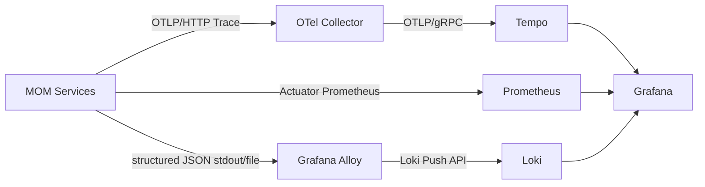

# 可观测性架构

## 1. 技术栈

```text
Spring Boot Actuator
Micrometer Observation
Micrometer Tracing
Spring Boot OpenTelemetry Starter
OTLP/HTTP
OpenTelemetry Collector
Tempo
Spring Boot Structured Logging
Grafana Alloy
Loki
Prometheus
Grafana Provisioning
```

业务代码优先使用 Micrometer Observation/Tracing API，避免直接绑定 OpenTelemetry SDK 或具体后端。

## 2. 数据流



应用只配置 Collector、暴露拉取式指标并输出结构化日志，不直接绑定 Tempo、Loki 或 Grafana。Prometheus、Alloy、Loki、Collector、Tempo 和 Grafana 均属于部署基础设施。

## 3. Trace 覆盖范围

必须覆盖：

- Browser/PDA 到 Gateway；
- Gateway 到领域服务；
- OpenFeign 同步调用；
- RocketMQ 生产、消费和重试；
- Outbox 发布任务；
- 定时任务和补偿任务；
- Integration Hub 入站和出站调用；
- MES 到 PCS 的命令与结果；
- WMS 到 WCS 的任务与回执。

自动埋点优先级：

1. Spring Boot / Spring Framework HTTP Server Observation；
2. Spring Cloud Gateway HTTP Client Observation；
3. OpenFeign Micrometer Observation；
4. Spring Cloud Stream Function Observation；
5. 官方埋点无法表达的平台操作才创建自定义 Observation。

`mom.outbox.publish` Observation 只覆盖单次 Outbox 发布尝试，不覆盖数据库领取事务，也不延长原始 HTTP Trace。

## 4. 传播与生命周期

- 服务间使用 W3C Trace Context；
- Header 注入与提取由框架 Propagator 完成，业务代码不手工拼接 `traceparent`；
- 同步 Gateway → Integration → MDM 保持同一短 Trace；
- Outbox 发布创建新的短 Trace，消息 Consumer 从 Broker Header 恢复上下文并创建消费 Span；
- 重试可以产生新的发布和消费 Span；Inbox 仍决定业务是否首次处理；
- Collector 或 Tempo 不可用时业务继续运行，遥测丢失由 Exporter/Collector 指标告警；
- 长时间制造流程不维持一个超长 Trace，每个阶段创建新 Trace，并通过业务关联标识连接。

## 5. 标识体系

| 标识 | 用途 | 生命周期 |
|---|---|---|
| `trace_id` | 一次技术调用链 | 秒到分钟 |
| `span_id` | Trace 内单个操作 | 毫秒到秒 |
| `correlation_id` | 跨 Trace 关联同一业务 | 小时到天 |
| `workflow_id` | 长流程实例 | 小时到天 |
| `event_id` | 领域事件幂等与追踪 | 长期 |
| `command_id` | PCS/WCS 命令幂等与追踪 | 分钟到小时 |
| 业务单号 | 送货、检验、工单、发运等 | 长期 |

Trace ID 和 Span ID 只用于技术诊断，不作为主键、权限主体、幂等键、审计主体或数据库唯一约束。客户端提供的 Trace ID 不属于可信身份数据。

## 6. 采样与属性

- 默认采样概率为 0.1；兼容性 CI 使用 1.0；
- 采样由平台配置统一控制，业务代码不得自行随机采样；
- 服务、路由、HTTP 方法、状态、事件类型和结果可以作为低基数指标属性；
- `event_id`、`correlation_id`、业务单号等仅作为受控高基数 Span 属性、日志字段或 Structured Metadata；
- 用户 ID、业务单号、Trace ID、事件 ID、命令 ID 和完整 URL 参数禁止作为 Prometheus 或 Loki 标签；
- Payload、Token、Cookie、密码、密钥和未脱敏敏感数据禁止进入指标、Span、日志或 Collector。

## 7. 日志规范

应用使用 Spring Boot 原生结构化 JSON 日志，至少包含：

- timestamp；
- level；
- service；
- environment；
- trace_id、span_id（存在活动 Span 时）；
- correlation_id（存在时）；
- event_id 或 command_id（存在时）；
- error_code；
- message。

Micrometer MDC Key 为 `traceId`、`spanId`，输出字段统一映射为 `trace_id`、`span_id`。没有活动 Span 时保持空值，不伪造标识。

Alloy 采集标准输出或受控日志文件并写入 Loki。Loki 流标签只允许 `service_name`、`environment` 和受控 `level`；Trace、Span、Correlation、Event 与 Command 标识保留在 JSON 内容或 Structured Metadata 中。

Promtail 已结束生命周期，MOM 新基线不再引入 Promtail。

禁止记录：

- Access Token、Refresh Token、Cookie；
- 密码、Client Secret、数据库凭证；
- 大型完整消息 Payload；
- 无脱敏个人和敏感业务信息。

## 8. 指标规范

所有 Meter 自动增加稳定的 `application` 与 `environment` 公共标签。

### 技术指标

- HTTP 请求量、耗时、P95 和错误率；
- JVM、GC、线程和连接池；
- Redis、数据库和 MQ 客户端指标；
- Gateway 限流 `allowed/rejected/unavailable`；
- Outbox 发布 `sent/retry/dead/cas_conflict`；
- Inbox 处理 `processed/duplicate/failed`；
- OTLP Exporter 发送失败、队列和丢弃；
- Collector 接收、拒绝、导出失败和队列。

当前自定义指标名：

- `mom.gateway.rate.limit.requests`；
- `mom.outbox.publish.results`；
- `mom.inbox.process.results`。

### 业务指标

- 收货成功/失败数量；
- 检验待处理和放行数量；
- 库存差异数量；
- 工单执行和异常数量；
- PCS/WCS 命令成功、失败和超时数量；
- 模拟召回影响批次数量。

Prometheus Label 只能使用低基数字段。指标记录失败不能改变业务响应、限流结果、事务或消息状态。

## 9. Grafana Provisioning 与仪表盘

Grafana 数据源、Dashboard Provider 和 Dashboard JSON 必须存入仓库，通过 provisioning 加载并保持只读。固定数据源 UID：

- `mom-prometheus`；
- `mom-loki`；
- `mom-tempo`。

Loki 的 Trace 派生字段连接 Tempo；Tempo 的 Trace-to-Logs 连接 Loki，服务图连接 Prometheus。

Phase 01 平台总览至少展示：

- 服务可用性；
- HTTP 请求量和 P95；
- JVM 与 Hikari；
- Gateway 限流结果；
- Outbox/Inbox 结果；
- 可按 Trace ID 查询的结构化日志。

后续领域 Dashboard 再增加 MES/PCS、WMS/WCS、批次追溯和业务 SLI。

## 10. 告警

V1 至少配置：

- 服务不可抓取；
- 5xx 错误率持续升高；
- P95 延迟超过阈值；
- Redis 限流基础设施不可用；
- Outbox DEAD；
- Inbox 消费持续失败；
- RocketMQ 消费延迟或死信增长；
- 数据库连接池耗尽；
- OTLP Exporter 或 Collector 持续丢弃；
- PCS/WCS 命令超时。

告警规则必须版本化并只使用低基数聚合标签。

## 11. 故障策略

Prometheus 使用 Pull 模型，应用不依赖 Prometheus 请求。Prometheus、Loki、Alloy、Grafana、Tempo、Collector 或 Exporter 不可用时：

- 业务请求和数据库事务继续；
- Outbox/Inbox、Broker 重试和确认语义不变；
- 不启动无界内存缓冲；
- 通过组件健康和自身指标暴露诊断能力降级。

法规审计数据必须进入权威业务存储，不能只依赖 Loki。

## 12. 验收场景

- 固定 W3C `traceparent` 经过 Gateway、Integration 和 MDM 后 Trace ID 保持一致；
- Prometheus 能抓取三个服务并查询 HTTP、JVM、Hikari 和自定义指标；
- 版本化告警规则成功加载；
- Alloy 将结构化日志写入 Loki，且 Trace/Correlation/Event ID 不成为 Loki 标签；
- Tempo 能查询 Gateway → Integration → MDM 完整同步 Trace；
- Grafana 三个数据源和平台 Dashboard 由 provisioning 创建且只读；
- 从 Loki 日志 Trace ID 跳转 Tempo，从 Tempo 查询对应日志；
- Prometheus 与 Loki 停止后业务请求仍成功；
- RocketMQ Consumer 执行时存在消费 Span，重复消息仍只有一个业务成功结果；
- 查询某个工单号关联的多个 Trace。
