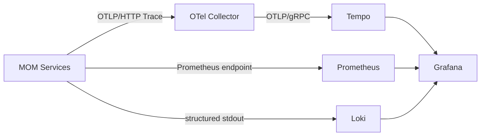

# 可观测性架构

## 1. 技术栈

```text
Spring Boot Actuator
Micrometer Observation
Micrometer Tracing
Spring Boot OpenTelemetry Starter
OTLP/HTTP
OpenTelemetry Collector
Tempo
Loki
Prometheus
Grafana
```

业务代码优先使用 Micrometer Observation/Tracing API，避免直接绑定 OpenTelemetry SDK 或具体 Trace 后端。

## 2. 数据流



应用只配置 Collector，不直接绑定 Tempo。Collector 负责批处理、后端路由和后续扩展。

## 3. Trace 覆盖范围

必须覆盖：

- Browser/PDA 到 Gateway；
- Gateway 到领域服务；
- OpenFeign 同步调用；
- RocketMQ 生产、消费和重试；
- Outbox 发布任务；
- 定时任务和补偿任务；
- Integration Hub 入站和出站调用；
- MES 到 PCS 的命令与结果；
- WMS 到 WCS 的任务与回执。

自动埋点优先级：

1. Spring Boot / Spring Framework HTTP Server Observation；
2. Spring Cloud Gateway HTTP Client Observation；
3. OpenFeign Micrometer Observation；
4. Spring Cloud Stream Function Observation；
5. 官方埋点无法表达的平台操作才创建自定义 Observation。

P01-S07 自定义 `mom.outbox.publish` Observation 只覆盖单次 Outbox 发布尝试，不覆盖数据库领取事务，也不延长原始 HTTP Trace。

## 4. 传播与生命周期

- 服务间使用 W3C Trace Context；
- Header 注入与提取由框架 Propagator 完成，业务代码不手工拼接 `traceparent`；
- 同步 Gateway → Integration → MDM 保持同一短 Trace；
- Outbox 发布创建新的短 Trace，消息 Consumer 从 Broker Header 恢复上下文并创建消费 Span；
- 重试可以产生新的发布和消费 Span；Inbox 仍决定业务是否首次处理；
- Collector 或 Tempo 不可用时业务继续运行，遥测丢失由 Exporter/Collector 指标告警；
- 长时间制造流程不维持一个超长 Trace，每个阶段创建新 Trace，并通过业务关联标识连接。

## 5. 标识体系

| 标识 | 用途 | 生命周期 |
|---|---|---|
| `trace_id` | 一次技术调用链 | 秒到分钟 |
| `span_id` | Trace 内单个操作 | 毫秒到秒 |
| `correlation_id` | 跨 Trace 关联同一业务 | 小时到天 |
| `workflow_id` | 长流程实例 | 小时到天 |
| `event_id` | 领域事件幂等与追踪 | 长期 |
| `command_id` | PCS/WCS 命令幂等与追踪 | 分钟到小时 |
| 业务单号 | 送货、检验、工单、发运等 | 长期 |

Trace ID 和 Span ID 只用于技术诊断，不作为主键、权限主体、幂等键、审计主体或数据库唯一约束。客户端提供的 Trace ID 不属于可信身份数据。

## 6. 采样与属性

- 默认采样概率为 0.1；兼容性 CI 使用 1.0；
- 采样由平台配置统一控制，业务代码不得自行随机采样；
- 服务、路由、HTTP 方法、状态、事件类型和结果可以作为低基数指标属性；
- `event_id`、`correlation_id`、业务单号等仅作为受控高基数 Span 属性或日志字段；
- 用户 ID、业务单号、Trace ID、事件 ID、命令 ID和完整 URL 参数禁止作为 Prometheus Label；
- Payload、Token、Cookie、密码、密钥和未脱敏敏感数据禁止进入 Span 属性、日志或 Collector。

## 7. 日志规范

结构化日志至少包含：

- timestamp；
- level；
- service；
- environment；
- trace_id；
- span_id；
- correlation_id（存在时）；
- event_id 或 command_id（存在时）；
- error_code；
- message。

Micrometer MDC Key 为 `traceId`、`spanId`，日志输出字段统一映射为 `trace_id`、`span_id`。没有活动 Span 时保持空值，不伪造标识。

禁止记录：

- Access Token、Refresh Token、Cookie；
- 密码、Client Secret、数据库凭证；
- 大型完整消息 Payload；
- 无脱敏个人和敏感业务信息。

## 8. 指标规范

所有 MOM 自定义 Meter 通过 `mom-metrics` 统一增加稳定的 `application` 与 `environment` 公共标签。部署环境优先读取 `mom.metrics.environment`，兼容 `MOM_ENVIRONMENT`，默认值为 `local`。

### 技术指标

- HTTP 请求量、耗时和错误率；
- JVM、GC、线程和连接池；
- Redis、数据库和 MQ 客户端指标；
- Gateway 限流允许、拒绝和基础设施不可用次数；
- Outbox 发布成功、重试、DEAD 和 CAS 冲突次数；
- Inbox 首次处理、重复消费和事务失败次数；
- Outbox 待发布数量和最大延迟；
- MQ 重试、死信和消费延迟；
- OTLP Exporter 发送失败、队列和丢弃；
- Collector 接收、拒绝、导出失败和队列。

当前稳定应用级指标：

| Micrometer 名称 | Prometheus 名称 | 标签 | 合法结果 |
|---|---|---|---|
| `mom.gateway.rate.limit.requests` | `mom_gateway_rate_limit_requests_total` | `application`、`environment`、`route`、`outcome` | `allowed`、`rejected`、`unavailable` |
| `mom.outbox.publish.results` | `mom_outbox_publish_results_total` | `application`、`environment`、`outcome` | `sent`、`retry`、`dead`、`cas_conflict` |
| `mom.inbox.process.results` | `mom_inbox_process_results_total` | `application`、`environment`、`consumer`、`outcome` | `processed`、`duplicate`、`failed` |

约束：

- `route` 和 `consumer` 必须是代码或配置中受控的稳定名称；
- 用户、IP、限流身份、事件 ID、Correlation ID、Payload 和异常消息不得成为标签；
- Outbox 只有 Broker 接受且 SENT CAS 成功才记录 `sent`；
- Outbox 状态 CAS 失败统一记录 `cas_conflict`，不能伪装成成功；
- Inbox `failed` 在事务异常原样向上抛出后记录，不吞掉异常；
- MeterRegistry 缺失或指标写入失败时，仅关闭或丢失遥测，不得改变限流、事务、消息重试和持久化结果。

### 业务指标

- 收货成功/失败数量；
- 检验待处理和放行数量；
- 库存差异数量；
- 工单执行和异常数量；
- PCS/WCS 命令成功、失败和超时数量；
- 模拟召回影响批次数量。

Prometheus Label 只能使用低基数字段，例如服务、路由、消费者、事件类型和结果。

## 9. Grafana 最小仪表盘

- 平台总览；
- Gateway 请求与 Redis 限流；
- JVM 与资源使用；
- PostgreSQL/Redis/RocketMQ 状态；
- Outbox/Inbox 与消息重试；
- MES/PCS 命令链路；
- WMS/WCS 入库链路；
- 批次追溯性能。

Prometheus、Loki、Grafana、Alloy 和 Stack Provisioning 已由 P01-S08 PR #13 建立。本次应用级指标补充只扩展应用暴露的 Meter 和告警规则，不重复建设观测后端与 Dashboard Provisioning。

## 10. 告警

V1 至少配置：

- `MOMServiceDown`：服务不可用；
- `MOMHighHttp5xxRate`：5xx 错误率持续升高；
- `MOMHikariPoolExhausted`：数据库连接池耗尽；
- `MOMGatewayRateLimitUnavailable`：Redis 限流基础设施失效并进入 fail-closed；
- `MOMOutboxDeadEvents`：Outbox 事件耗尽自动重试并进入 DEAD；
- `MOMInboxProcessingFailures`：Inbox 消费事务持续失败；
- RocketMQ 消费延迟或死信增长；
- OTLP Exporter 或 Collector 持续丢弃；
- PCS/WCS 命令超时。

告警规则必须版本化，只使用低基数聚合标签。普通 `rejected` 限流结果不直接触发基础设施故障告警，因为它可能是正常保护行为；容量告警应结合路由基线和业务流量另行设计。

## 11. 验收场景

- 固定 W3C `traceparent` 经过 Gateway、Integration 和 MDM 后 Trace ID 保持一致；
- Integration 和 MDM 拥有不同 Server Span；
- 从错误日志跳转到 Trace，从 Trace 查看对应日志；
- Tempo 能查询 Gateway → Integration → MDM 完整同步 Trace；
- Collector 停止后业务请求仍成功；
- RocketMQ Consumer 执行时存在消费 Span，重复消息仍只有一个业务成功结果；
- Prometheus 可查询三个应用级 Counter，并且不存在用户、IP、事件 ID、Token 或 Payload 标签；
- Redis 限流不可用、Outbox DEAD 和 Inbox 事务失败能够触发对应版本化告警；
- 指标注册表缺失或抛出异常时，原有业务、限流和消息状态机测试仍通过；
- 查看 MES → RocketMQ → PCS → RocketMQ → MES 的异步链路；
- PCS 超时后能看到等待、重试、人工接管或恢复 Span；
- 查询某个工单号关联的多个 Trace。
