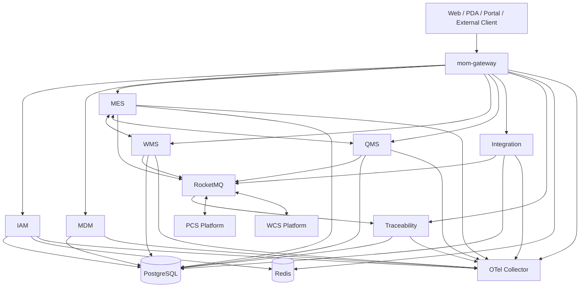

# 服务与容器架构

本文中的“容器”采用 C4 Model 含义，表示可独立运行或部署的应用与数据组件，不特指 Docker 容器。

## 1. 应用服务

| 服务 | 默认端口建议 | V1 职责 |
|---|---:|---|
| `mom-gateway` | 8080 | 路由、认证、限流、审计、上下文传递 |
| `mom-iam-server` | 8100 | OAuth2.1/OIDC、用户、Client、角色和权限 |
| `mom-mdm-server` | 8200 | 组织、工厂、物料、供应商、客户和版本索引 |
| `mom-mes-server` | 8300 | 工单、版本快照、投料、过程记录和产出 |
| `mom-wms-server` | 8400 | 仓库、库位、容器、库存、预占、流水和余额 |
| `mom-qms-server` | 8500 | 检验、放行、不合格处置、偏差和 CAPA |
| `mom-ems-server` | 8600 | V1 最小能源台账和模拟采集 |
| `mom-eam-server` | 8700 | V1 最小设备台账、点检和维护记录 |
| `mom-integration-server` | 8800 | 外部接口、映射、Outbox/Inbox、重试和补偿 |
| `mom-traceability-server` | 8900 | 批次谱系、影响分析和模拟召回 |

端口只是本地开发建议，k3s 内部访问以 Service 名称为准。

## 2. 数据与中间件

| 组件 | 用途 |
|---|---|
| PostgreSQL 17 | 各领域权威数据，按服务独立 Schema |
| Redis | 缓存、限流状态、幂等辅助和短期安全状态 |
| RocketMQ | 领域事件、设备命令结果和异步集成 |
| Nacos | 服务注册发现和配置导入 |
| Seata | 短事务 AT 和少量关键资源 TCC PoC |
| MQTT Broker | PCS 高频但非关键控制数据的模拟接入 |

## 3. 可观测性组件

| 组件 | 用途 |
|---|---|
| OpenTelemetry Collector | OTLP 接收、处理和转发 |
| Tempo | Trace 存储与查询 |
| Loki | 日志聚合 |
| Prometheus | 技术与业务指标 |
| Grafana | 统一仪表盘与关联查询 |

## 4. 服务协作

## 5. 部署边界

- 每个 `*-server` 是独立部署单元。
- `*-api` 与 `*-client` 只作为 Maven 依赖，不单独部署。
- EMS、EAM 在 V1 可保持单副本和最小实现。
- Gateway、IAM、MES、WMS、QMS、Integration 和 Traceability 应支持多副本。
- PCS、WCS、Web、Mobile、ERP Simulator 和 Infra 位于独立仓库。

## 6. 禁止事项

- 禁止通过数据库跨 Schema JOIN 代替服务接口或查询模型。
- 禁止 Gateway 承担领域业务逻辑。
- 禁止 Integration Hub 成为通用业务编排中心。
- 禁止所有服务共享一个大而全的 `common` 业务模块。
- 禁止让 PCS/WCS 协议类型泄漏到 MES/WMS 领域模型。