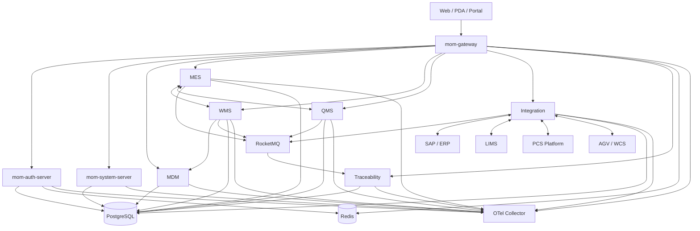

# 服务与容器架构

- 状态：Current
- 当前阶段：Mini Auth V1

本文中的“容器”采用 C4 Model 含义，表示可独立运行或部署的应用与数据组件，不特指 Docker 容器。各服务实际端口以对应 `application.yml` 为事实来源，不在架构文档重复维护易漂移的端口表。

## 1. 应用服务

| 服务 | 当前职责 |
|---|---|
| `mom-gateway` | 路由、Bearer 边缘检查、Header 清洗、限流、Correlation ID |
| `mom-auth-server` | User、Role、Permission、用户名密码认证、Opaque Token、Logout |
| `mom-system-server` | 参数、字典、国际化资源、用户偏好等平台配置 |
| `mom-mdm-server` | 组织、工厂、物料、供应商、客户和基础主数据 |
| `mom-mes-server` | 工单、版本快照、投料、过程记录和产出 |
| `mom-wms-server` | 仓库、库位、容器、库存、预占、流水和余额 |
| `mom-qms-server` | 检验、放行、不合格处置、偏差和 CAPA |
| `mom-ems-server` | V1 最小能源台账和模拟采集 |
| `mom-eam-server` | V1 最小设备台账、点检和维护记录 |
| `mom-integration-server` | 外部接口、映射、Outbox/Inbox、重试、补偿和对账 |
| `mom-traceability-server` | 批次谱系、影响分析和模拟召回 |

`mom-auth-server` 替代旧 `mom-iam-server` 作为当前 V1 身份权限服务。当前不建设 Spring Authorization Server、OIDC 或 OAuth Client 管理。

## 2. 数据与中间件

| 组件 | 用途 |
|---|---|
| PostgreSQL 17 | 各领域权威数据，按服务独立 Schema |
| Redis | Opaque Token 权威状态、Gateway 限流状态、缓存与幂等辅助 |
| RocketMQ | 领域事件、设备命令结果和异步集成 |
| Nacos | 服务注册发现和配置导入 |
| Seata | 仅在真实短事务跨服务场景出现时评估使用 |
| MQTT Broker | PCS 高频但非关键控制数据的模拟接入 |

Token Store 与普通 Cache 语义分离；Gateway 限流实现归 `mom-gateway` 本地，不再存在独立 `mom-rate-limit` Framework Module。

## 3. 可观测性组件

| 组件 | 用途 |
|---|---|
| OpenTelemetry Collector | OTLP 接收、处理和转发 |
| Tempo | Trace 存储与查询 |
| Loki | 日志聚合 |
| Prometheus | 技术与业务指标 |
| Grafana | 统一仪表盘与关联查询 |

内部 OpenFeign 调用保留 Micrometer Observation 能力，并传播 `X-Correlation-Id`。

## 4. 服务协作


```mermaid
flowchart TB
  Client[Web / PDA / Portal] --> GW[mom-gateway]
  GW --> AUTH[mom-auth-server]
  GW --> SYS[mom-system-server]
  GW --> MDM[MDM]
  GW --> MES[MES]
  GW --> WMS[WMS]
  GW --> QMS[QMS]
  GW --> INT[Integration]
  GW --> TRACE[Traceability]

  MES <--> WMS
  MES <--> QMS
  WMS --> MDM

  INT --> MQ[RocketMQ]
  MES --> MQ
  WMS --> MQ
  QMS --> MQ
  MQ --> TRACE

  INT <--> SAP[SAP / ERP]
  INT <--> LIMS[LIMS]
  INT <--> PCS[PCS Platform]
  INT <--> AGV[AGV / WCS]

  AUTH --> PG[(PostgreSQL)]
  SYS --> PG
  MDM --> PG
  MES --> PG
  WMS --> PG
  QMS --> PG
  INT --> PG
  TRACE --> PG

  AUTH --> REDIS[(Redis)]
  GW --> REDIS

  GW --> OTEL[OTel Collector]
  AUTH --> OTEL
  SYS --> OTEL
  MDM --> OTEL
  MES --> OTEL
  WMS --> OTEL
  QMS --> OTEL
  INT --> OTEL
  TRACE --> OTEL
```

## 5. 内部同步调用

MOM 内部服务同步 HTTP RPC 使用：

```text
*-api
  ↑
*-client
  ↓
mom-openfeign
  ├── OpenFeign
  ├── LoadBalancer
  ├── Micrometer
  ├── X-Correlation-Id
  └── current Bearer Authorization
```

当前 Servlet 请求存在 Bearer 时，`mom-openfeign` 原样传播给下游 Resource Server；目标服务独立验证 Token。

无当前 Servlet 请求时不生成 Authorization，也不自动生成 SYSTEM/SERVICE 身份。后台机器调用的认证方式在真实需求出现后再扩展。

`mom-openfeign` 只用于 MOM 内部同步 RPC。SAP、LIMS、PCS、AGV/WCS 等外部系统调用由 Integration/Infrastructure Adapter 使用独立 HTTP Client 或 SDK，不能继承当前用户 Bearer。

## 6. 异步协作

业务事件、长流程、补偿与设备协作不因为存在 OpenFeign 就全部改成同步调用。需要跨时间、可重试或解耦的流程按实际业务使用 RocketMQ、Outbox/Inbox、幂等、补偿和对账。

用户触发的异步链路保留审计/关联身份信息时，应区分“业务发起人”与“系统间认证凭据”；V1 不把用户 Access Token 当作长期异步凭据保存或传播。

## 7. 部署边界

- 每个 `*-server` 是独立部署单元。
- `*-api` 与 `*-client` 只作为 Maven 依赖，不单独部署。
- EMS、EAM 在 V1 可保持单副本和最小实现。
- Gateway、Auth、MES、WMS、QMS、Integration 和 Traceability 可按负载需求支持多副本。
- PCS、WCS、Web、Mobile、ERP Simulator 和 Infra 保持独立系统/仓库边界。

## 8. 禁止事项

- 禁止通过数据库跨 Schema JOIN 代替服务接口或查询模型。
- 禁止 Gateway 承担真实 Token 认证或领域业务逻辑。
- 禁止 Integration Hub 成为通用业务编排中心。
- 禁止所有服务共享一个大而全的 `common` 业务模块。
- 禁止让 PCS/WCS/LIMS 协议类型泄漏到 MES/WMS/QMS 领域模型。
- 禁止第三方/外部系统调用复用 `mom-openfeign` 并获得内部用户 Bearer。
- 禁止在无用户请求上下文时自动伪造管理员或系统 Token。