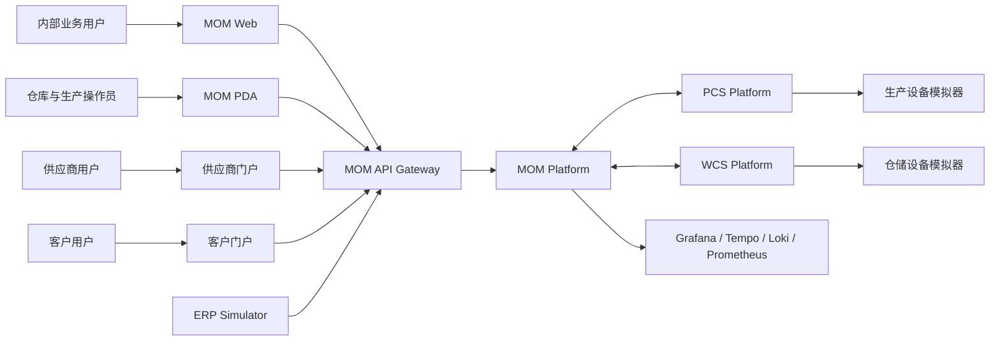

# 系统上下文

## 1. 系统定位

MOM Platform 位于企业 ERP 与车间设备控制系统之间，负责将供应链、生产、质量、仓储、设备和追溯业务连接为可执行、可审计、可恢复的制造运营闭环。

## 2. 上下文关系

## 3. 外部参与者

| 参与者 | 主要目标 | 接入方式 |
|---|---|---|
| 内部业务用户 | 计划、生产、质量、仓储和设备管理 | MOM Web |
| PDA 操作员 | 收货、上架、领料、拣货和发运 | mom-mobile |
| 供应商 | 送货通知和状态查询 | 供应商门户 |
| 客户 | 订单、发运和质量信息查询 | 客户门户 |
| ERP Simulator | 模拟订单、物料、供应商和客户集成 | Gateway + Integration Hub |
| PCS Platform | 生产设备命令、状态和过程数据 | API + RocketMQ/MQTT |
| WCS Platform | 自动仓储任务、路由和回执 | API + RocketMQ |
| 运维人员 | 部署、监控、告警、追踪和恢复 | k3s + Grafana |

## 4. 系统边界

### MOM Platform 负责

- 制造业务事实和流程状态。
- 用户、权限和数据范围。
- 生产、库存、质量和批次谱系。
- 外部系统接口的业务治理。
- PCS/WCS 命令的业务发起与结果消费。

### MOM Platform 不负责

- PLC/DCS 硬实时控制。
- 设备安全联锁。
- 真实输送和运动控制。
- ERP 财务和采购结算。
- 完整 APS 优化。

## 5. 信任边界

- 所有外部请求必须经过 Gateway。
- ERP、供应商、客户、PCS、WCS 使用独立 OAuth2 Client。
- 外部系统不得直接访问领域服务数据库或内部接口。
- 领域服务之间禁止跨 Schema 读写。
- 运维组件使用独立管理网络和凭证。

## 6. 关键业务关联标识

- `trace_id`：单次技术调用链。
- `correlation_id`：跨 Trace 的业务关联。
- `workflow_id`：长时间业务流程实例。
- `event_id`：领域事件唯一标识。
- `command_id`：PCS/WCS 命令唯一标识。
- 业务单号：送货单、检验单、工单、发运单等领域标识。