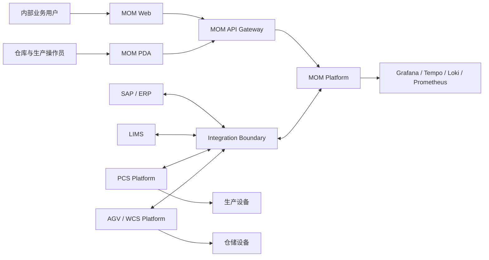

# 系统上下文

- 状态：Current
- 当前阶段：Mini Auth V1

## 1. 系统定位

MOM Platform 位于企业 ERP 与车间设备控制系统之间，负责将供应链、生产、质量、仓储、设备和追溯业务连接为可执行、可审计、可恢复的制造运营闭环。

## 2. 上下文关系


```mermaid
flowchart LR
  Internal[内部业务用户] --> Web[MOM Web]
  Warehouse[仓库与生产操作员] --> PDA[MOM PDA]

  Web --> GW[MOM API Gateway]
  PDA --> GW
  GW --> MOM[MOM Platform]

  ERP[SAP / ERP] <--> INT[Integration Boundary]
  LIMS[LIMS] <--> INT
  PCS[PCS Platform] <--> INT
  WCS[AGV / WCS Platform] <--> INT
  INT <--> MOM

  PCS --> Devices[生产设备]
  WCS --> WarehouseDevices[仓储设备]

  MOM --> OBS[Grafana / Tempo / Loki / Prometheus]
```

## 3. 外部参与者

| 参与者 | 主要目标 | 当前接入边界 |
|---|---|---|
| 内部业务用户 | 计划、生产、质量、仓储和设备管理 | MOM Web → Gateway |
| PDA 操作员 | 收货、上架、领料、拣货和发运 | MOM PDA → Gateway |
| SAP / ERP | 订单、主数据、账务与业务结果集成 | Integration Boundary |
| LIMS | 样品、批次检验与结果回传 | Integration Boundary |
| PCS Platform | 生产设备命令、状态和过程数据 | Integration Boundary + MQ/API |
| AGV / WCS Platform | 自动仓储任务、路由和回执 | Integration Boundary + MQ/API |
| 运维人员 | 部署、监控、告警、追踪和恢复 | k3s + Observability |

供应商门户、客户门户等外部用户入口不是 Mini Auth V1 当前认证范围；出现真实需求后再确定身份模型和接入协议。

## 4. MOM Platform 负责

- 制造业务事实和流程状态。
- 当前 V1 的内部用户、角色、权限和登录 Token。
- 生产、库存、质量和批次谱系。
- 外部系统接口的协议适配、幂等、补偿和对账。
- PCS/WCS 命令的业务发起与结果消费。

## 5. MOM Platform 不负责

- PLC/DCS 硬实时控制。
- 设备安全联锁。
- 真实输送和运动控制。
- ERP 财务和采购结算。
- 完整 APS 优化。
- V1 阶段的第三方 OAuth Client、OIDC/SSO 或机器身份平台。

## 6. 信任边界

### 6.1 用户入口

内部用户请求经过 Gateway：

```text
Web / PDA
  ↓ Bearer opaque token
Gateway
  ↓ 边缘检查 + Header 清洗
Resource Server
  ↓ Redis Opaque Token validation
```

Gateway 不是真实 Token 认证权威。

### 6.2 MOM 内部同步调用

MOM 内部服务通过 `*-client + mom-openfeign` 进行同步 HTTP RPC。当前用户请求存在时原样传播 Bearer，由下游 Resource Server 再次验证。

`mom-openfeign` 只允许用于 MOM 内部服务调用，不是外部 HTTP Client。

### 6.3 外部系统

SAP、LIMS、PCS、AGV/WCS 等外部系统通过 Integration/Infrastructure Adapter 接入，不得继承 MOM 内部用户 Bearer，也不得直接访问领域服务数据库或内部 Feign 接口。

Mini Auth V1 不预设外部系统必须采用 OAuth2 Client。每个外部系统的认证方式由真实接口协议决定；如后续需要 client_credentials、签名、证书或其他机器身份，再单独设计。

### 6.4 后台系统调用

Scheduler、MQ Consumer、补偿任务等没有当前 Servlet 用户请求时，OpenFeign 不自动生成 Authorization。SYSTEM/SERVICE 身份属于后续真实需求，不在 Mini Auth V1 提前实现。

## 7. 数据与服务边界

- PostgreSQL 按服务独立 Schema，禁止跨领域写入和跨 Schema JOIN。
- 业务服务不得访问其他服务的 Repository、Mapper 或 Entity。
- 外部系统不得绕过 Integration/明确 API 边界直接访问领域数据库。
- 异步业务事实通过事件/MQ、Outbox/Inbox 等机制传播，不依赖长期保存用户 Access Token。

## 8. 关键业务关联标识

- `trace_id`：单次技术调用链。
- `correlation_id`：跨 Trace 的业务关联。
- `workflow_id`：长时间业务流程实例。
- `event_id`：领域事件唯一标识。
- `command_id`：PCS/WCS 命令唯一标识。
- 业务单号：送货单、检验单、工单、发运单等领域标识。