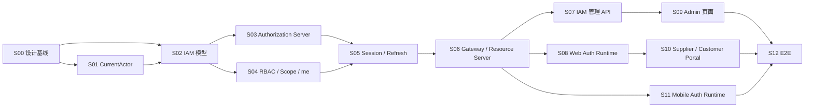

# P1.5：认证与授权闭环实施计划

- 阶段：`P1.5`
- 名称：认证与授权闭环
- 当前 Slice：`S04`
- 当前状态：**S04 In Progress**
- 权威设计：[P1.5 认证与授权设计基线](../security/P1.5-认证与授权设计基线.md)
- 实施进度：[P1.5 实施进度](P1.5-实施进度.md)

## 1. 阶段目标

在 Phase 01 基础技术骨架之上，完成 IAM、OAuth 2.0/OIDC、Authorization Code + PKCE、Gateway 与业务服务 Resource Server、RBAC、Factory/Party Scope、用户授权 Session、Refresh Rotation 与撤销、IAM 管理 API、Web/Mobile Auth Runtime 和安全 E2E。

P1.5 完成前，不得把 Phase 02 业务端到端闭环标记为可安全上线或已具备完整认证授权边界。

## 2. 当前真实状态

已完成并合并：

- S00：跨仓库认证授权设计、ADR、职责矩阵和 Definition of Done；
- S01：CurrentActor、显式 SYSTEM Actor、MyBatis-Plus 强制审计、受控更新路径和乐观锁；
- S02：IAM 独立 PostgreSQL Schema、正式 Flyway、用户与 Party Binding、RBAC、Factory Scope、Mobile Access、Client Policy、Spring Security Authorization Server 官方 JDBC 协议表、Session/Refresh 安全状态、安全审计、Entity、Mapper、Repository 和 PostgreSQL 集成测试。

S03 已在长期阶段分支完成并通过全量 CI：

- Spring Authorization Server 与 OpenID Connect；
- Authorization Code + PKCE S256；
- 四个 Public Client 的环境相关 Registered Client 配置；
- IAM 登录页面、CSRF、账号密码认证、临时锁定和首次改密；
- Client 与 `user_type` 入口隔离；
- JDBC Registered Client、Authorization、Consent Store；
- RS256、固定 `kid`、JWK Set、10 分钟 JWT Access Token 和 OIDC ID Token。

当前 S04 正在阶段分支实现：

- User → Role → Permission 有效授权计算；
- Factory Scope 与外部 Party Scope；
- JWT `roles`、`permissions`、`factory_ids`、`party_type`、`party_id`；
- `/api/iam/me`；
- Current Factory 校验与对象不可见时统一 404 的基础契约。

尚未具备：

- S05 Refresh Rotation、重放检测、Session 撤销和 revoked sid；
- Gateway 与业务服务 Resource Server；
- IAM 管理 API 与管理页面；
- Web/Mobile 登录闭环与安全 E2E。

## 3. Slice 计划

### Slice 00：设计基线 — Completed

建立跨仓库权威设计、ADR、职责矩阵、实施计划和 Definition of Done。

### Slice 01：CurrentActor 与数据审计基础 — Completed / Merged

实现 `AuditActor`、`ActorType`、`CurrentActorProvider`、`AuditContextExecutor`、Security Actor 适配、MyBatis-Plus 审计、UTC Clock、显式 SYSTEM Actor、乐观锁和受控更新路径。

### Slice 02：IAM 数据库与领域模型 — Completed / Merged

实现并合并：

- 用户、账号锁定字段、内部资料和 Party Binding；
- Role、Permission、用户角色、角色权限；
- Factory Scope、Mobile Access；
- Client Policy 与 Spring Security 官方协议表；
- 用户授权 Session、Refresh Token 轮换状态、安全审计；
- PostgreSQL Flyway、索引、约束、完整中文注释；
- Entity、Enum、Mapper、Repository、领域校验和 Testcontainers。

### Slice 03：Authorization Server 与账号认证 — Completed in phase branch

已实现 Spring Authorization Server、OIDC、Authorization Code + PKCE S256、四个 Public Client、IAM 登录页面与 CSRF、账号密码认证、临时锁定、首次修改密码、Client 与 `user_type` 访问矩阵、JDBC OAuth Store、JWK/JWT 签发基础和 10 分钟 Access Token。

本 Slice 未提前实现 S04 完整权限 Claims、`/api/iam/me`，也未提前实现 S05 自定义 Refresh Rotation、重放检测、Session 撤销或 Redis revoked sid。

### Slice 04：RBAC、Factory Scope 与 `/api/iam/me` — In Progress

实现 User → Role → Permission、Factory/Party Scope、JWT Claims、`/api/iam/me`、Current Factory 校验和对象不可见时统一 404 的基础契约。

### Slice 05：Session、Refresh Rotation 与撤销 — Pending

实现 Web 8 小时、Mobile 12 小时绝对 Session，Opaque Refresh Token + HMAC-SHA-256、单 ACTIVE Token、事务行锁、Rotation、重放检测、COMPROMISED、Redis revoked sid 和撤销事件。

### Slice 06：Gateway 与 Resource Server — Pending

实现 Gateway JWT/Issuer/Audience/revoked sid、伪造 Header 清理、Bearer 转发、业务服务二次验证、Permission、Factory/Party Scope、对象归属和 404 防枚举。

### Slice 07：IAM 管理 API — Pending

实现用户、角色、Permission 目录、Factory Scope、Mobile Access、Session、安全审计、OAuth Client 查看/受控启停、外部主体重新绑定和至少一个有效 PLATFORM_ADMIN 约束。

### Slice 08：Web Auth Runtime — Pending

`mom-platform` 完成契约核验；`mom-web` 实现 `@mom/auth`、`@mom/access`、`@mom/api-client`、三应用 PKCE、内存 Token、Single Flight Refresh 和 `/api/iam/me`。

### Slice 09：MOM Admin 权限管理页面 — Pending

实现用户、角色、Factory Scope、Mobile Access、Permission 目录、Session 和安全审计页面。

### Slice 10：Supplier Portal 与 Customer Portal — Pending

实现门户登录、主体固定、Factory Scope、业务入口与错误处理。

### Slice 11：Mobile Auth Runtime — Pending

实现系统浏览器 + PKCE、App Link、安全存储、冷启动恢复、Single Flight Refresh 和离线命令归属。

### Slice 12：安全 E2E 与 P1.5 封板 — Pending

完成登录、刷新、退出、撤销、重放、Client/user_type 隔离、Permission、Factory/Party、404 防枚举、Web/Mobile 恢复、Redis Fail Closed、敏感信息扫描和三仓库一致性验收。

## 4. 跨仓库影响矩阵

| Slice | mom-platform | mom-web | mom-mobile |
|---|---|---|---|
| S00 | 设计权威、后端 ADR | Web 设计对齐 | Mobile 设计对齐 |
| S01～S07 | 实现 | 无 | 无 |
| S08 | 契约核验 | 实现 | 无 |
| S09～S10 | API 联调 | 实现 | 无 |
| S11 | 契约核验 | 无 | 实现 |
| S12 | 验收 | 验收 | 验收 |

## 5. Slice 依赖

## 6. P1.5 Definition of Done

1. 四个 Public Client、三种 user_type 与应用访问矩阵实现并通过 E2E。
2. Web 和 Mobile 均使用 Authorization Code + PKCE，密码只提交 IAM 页面。
3. Access Token、Opaque Refresh Token、ID Token 的用途和生命周期与权威基线一致。
4. Refresh Rotation、重放检测、Session 撤销、revoked sid 与 Redis Fail Closed 已验证。
5. Gateway 和业务服务职责边界实现并测试，前端判断不构成安全边界。
6. RBAC、Permission、Factory Scope、Party Scope、对象归属与 404 防枚举通过测试。
7. `/api/iam/me` 成为 Web/Mobile 权限上下文来源。
8. CurrentActor、MyBatis-Plus 审计字段自动填充、显式 SYSTEM Actor 和乐观锁已实现。
9. IAM 管理 API、MOM Admin 权限管理页面、安全审计和 Session 管理可用。
10. Web Token 不持久化；Mobile Refresh Token 使用 Android 安全存储；离线命令不能跨用户自动同步。
11. 所有正式 PostgreSQL Flyway DDL 都有完整准确的中文表/字段/枚举/约束/索引/JSON/UTC/安全边界注释。
12. 三仓库文档、代码、Claims、Client ID、user_type、错误处理和阶段状态一致。