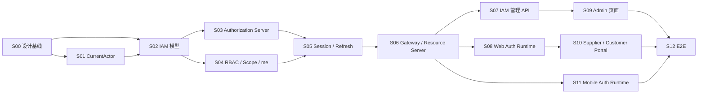

# P1.5：认证与授权闭环实施计划

- 阶段：`P1.5`
- 名称：认证与授权闭环
- 当前 Slice：`S00`
- 当前状态：**Design Baseline In Review**
- 权威设计：[P1.5 认证与授权设计基线](../security/P1.5-认证与授权设计基线.md)

## 1. 阶段目标

在 Phase 01 基础技术骨架之上，完成 IAM、OAuth 2.0/OIDC、Authorization Code + PKCE、Gateway 与业务服务 Resource Server、RBAC、Factory/Party Scope、用户授权 Session、Refresh Rotation 与撤销、IAM 管理 API、Web/Mobile Auth Runtime 和安全 E2E。

P1.5 完成前，不得把 Phase 02 业务端到端闭环标记为可安全上线或已具备完整认证授权边界。

## 2. 当前真实状态

已具备：

- Maven 多模块和领域模块骨架
- `mom-security` 的 Spring Security / OAuth2 Resource Server 依赖基线
- Gateway、IAM、MDM、Integration 等最小启动应用
- Redis、PostgreSQL、消息、Trace、日志、指标和告警基础设施

尚未具备：

- 正式 Authorization Server 配置与授权页面
- 四个 Public Client 的完整注册
- 用户、角色、Permission、Factory/Party Scope 正式领域模型与 DDL
- Gateway JWT/Issuer/Audience/revoked sid 完整校验
- 业务服务 Resource Server 与最终授权
- `/api/iam/me`
- Refresh Rotation、重放检测和 Session 撤销
- IAM 管理 API 与管理页面
- Web/Mobile 登录闭环
- 安全 E2E

## 3. Slice 计划

### Slice 00：设计基线

**目标**：建立跨仓库权威设计、ADR、职责矩阵、实施计划和 Definition of Done。

**允许**：Markdown、README、阶段状态、文档索引、ADR、Mermaid。

**禁止**：Java/Vue/TypeScript 业务代码、正式 Flyway DDL、Authorization Server 配置、JWT、Resource Server、登录页面、RBAC API、Session Rotation。

### Slice 01：CurrentActor 与数据审计基础

`mom-platform` 实现：

- `AuditActor`
- `ActorType`
- `CurrentActorProvider`
- `AuditContextExecutor`
- `mom-security` 当前用户 Actor 适配
- `mom-data` MyBatis-Plus `MetaObjectHandler`
- UTC `Instant`、可注入 `Clock`、显式 SYSTEM Actor
- 乐观锁与禁止绕过自动填充的路径

### Slice 02：IAM 数据库与领域模型

`mom-platform` 实现：

- 用户、账号锁定、Party Binding、Role、Permission、用户角色、角色权限
- Factory Scope、Mobile Access
- OAuth Client、用户授权 Session、Refresh Token 轮换记录、安全审计
- PostgreSQL Flyway DDL、索引、约束和完整中文注释

### Slice 03：Authorization Server 与账号认证

`mom-platform` 实现：

- Spring Authorization Server
- OIDC
- Authorization Code + PKCE S256
- 四个 Public Client
- IAM 登录页面与 CSRF
- 账号密码认证、锁定、首次修改密码
- 应用与 user_type 入口矩阵

### Slice 04：RBAC、Factory Scope 与 `/api/iam/me`

`mom-platform` 实现：

- User → Role → Permission
- Permission Code 预置
- Factory Scope、Party Scope
- JWT Claims
- `/api/iam/me`
- Current Factory 校验契约

### Slice 05：Session、Refresh Rotation 与撤销

`mom-platform` 实现：

- Web 8 小时、Mobile 12 小时绝对 Session
- Opaque Refresh Token + HMAC-SHA-256 摘要
- 单 ACTIVE Refresh Token
- 事务、行锁、Rotation、重放检测
- `COMPROMISED`、Redis revoked sid、Fail Closed
- 用户禁用、密码修改、Client/Mobile Access 等撤销事件

### Slice 06：Gateway 与 Resource Server

`mom-platform` 实现：

- Gateway JWT、Issuer、Audience、过期、Client 入口、revoked sid
- 删除伪造 `X-MOM-*` Header
- Bearer JWT 原样转发
- 业务服务二次 Resource Server 验证
- Permission、Factory/Party Scope、对象归属和 404 防枚举

### Slice 07：IAM 管理 API

`mom-platform` 实现：

- 用户、角色、Permission 目录、Factory Scope、Mobile Access
- Session 管理、安全审计、OAuth Client 查看/受控启停
- 外部主体高风险重新绑定
- 至少一个有效 `PLATFORM_ADMIN` 约束

### Slice 08：Web Auth Runtime

- `mom-platform`：契约核验
- `mom-web`：实现 `@mom/auth`、`@mom/access`、`@mom/api-client`，三应用 PKCE、内存 Token、Single Flight Refresh、`/api/iam/me`

### Slice 09：MOM Admin 权限管理页面

- `mom-platform`：API 联调
- `mom-web`：用户、角色、Factory Scope、Mobile Access、Permission 目录、Session、安全审计页面

### Slice 10：Supplier Portal 与 Customer Portal

- `mom-platform`：API 联调
- `mom-web`：门户登录、主体固定、Factory Scope、业务入口与错误处理

### Slice 11：Mobile Auth Runtime

- `mom-platform`：契约核验
- `mom-mobile`：系统浏览器 + PKCE、App Link、安全存储、冷启动恢复、Single Flight Refresh、离线命令归属

### Slice 12：安全 E2E 与 P1.5 封板

三个仓库共同完成：

- 登录、刷新、退出、撤销、重放、Client/user_type 隔离
- 权限、Factory、Party、对象归属与 404 防枚举
- Web 刷新恢复、Mobile 冷启动、离线命令跨用户隔离
- Redis 故障 Fail Closed
- 日志与安全审计敏感信息扫描
- 文档、代码、DDL、Claims、错误码和运行时一致性验收

## 4. 跨仓库影响矩阵

| Slice | mom-platform | mom-web | mom-mobile |
|---|---|---|---|
| S00 | 设计权威、后端 ADR | Web 设计对齐 | Mobile 设计对齐 |
| S01 | 实现 | 无 | 无 |
| S02 | 实现 | 无 | 无 |
| S03 | 实现 | 无 | 无 |
| S04 | 实现 | 无 | 无 |
| S05 | 实现 | 无 | 无 |
| S06 | 实现 | 无 | 无 |
| S07 | 实现 | 无 | 无 |
| S08 | 契约核验 | 实现 | 无 |
| S09 | API 联调 | 实现 | 无 |
| S10 | API 联调 | 实现 | 无 |
| S11 | 契约核验 | 无 | 实现 |
| S12 | 验收 | 验收 | 验收 |

## 5. Slice 依赖

## 6. P1.5 Definition of Done

P1.5 只有同时满足以下条件才可封板：

1. 四个 Public Client、三种 user_type 与应用访问矩阵实现并通过 E2E。
2. Web 和 Mobile 均使用 Authorization Code + PKCE，密码只提交 IAM 页面。
3. Access Token、Opaque Refresh Token、ID Token 的用途和生命周期与权威基线一致。
4. Refresh Rotation、重放检测、Session 撤销、revoked sid 与 Redis Fail Closed 已验证。
5. Gateway 和业务服务职责边界实现并测试，前端判断不构成安全边界。
6. RBAC、Permission、Factory Scope、Party Scope、对象归属与 404 防枚举通过测试。
7. `/api/iam/me` 成为 Web/Mobile 权限上下文来源。
8. CurrentActor、MyBatis-Plus 审计字段自动填充、显式 SYSTEM Actor 和乐观锁已实现。
9. IAM 管理 API、MOM Admin 权限管理页面、安全审计和 Session 管理可用。
10. Web Token 不持久化；Mobile Refresh Token 使用 Android 安全存储；离线命令不能跨用户自动同步。
11. 所有正式 PostgreSQL Flyway DDL 都有完整准确的中文表/字段/枚举/约束/索引/JSON/UTC/安全边界注释；缺少中文注释即未完成。
12. 三仓库文档、代码、Claims、Client ID、user_type、错误处理和阶段状态一致。

## 7. S00 验收清单

- [x] 权威设计基线已建立
- [x] Phase 01 的安全完成状态已纠偏
- [x] 旧 OAuth ADR 已由新 ADR 替代
- [x] S01～S12 已规划
- [x] 跨仓库职责矩阵已建立
- [x] 数据库中文注释规则已进入 DoD
- [ ] 三仓库 PR 全部创建并完成最终一致性检查
